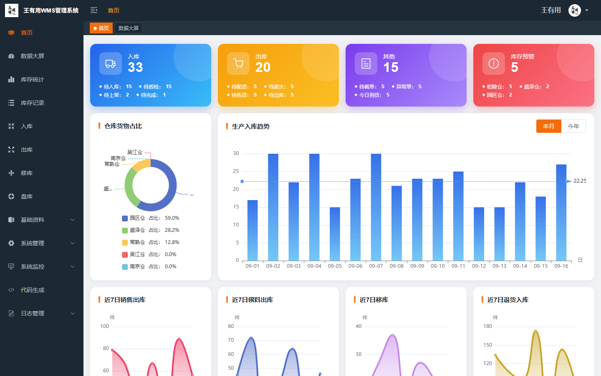
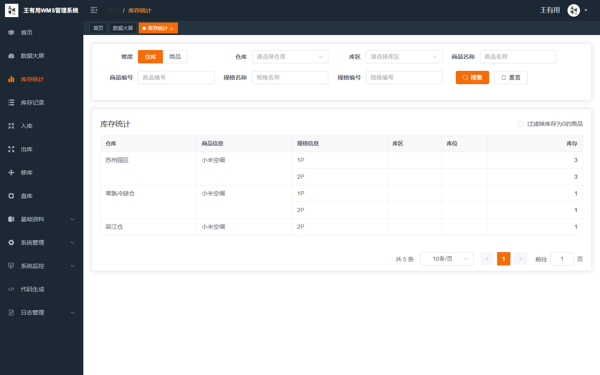
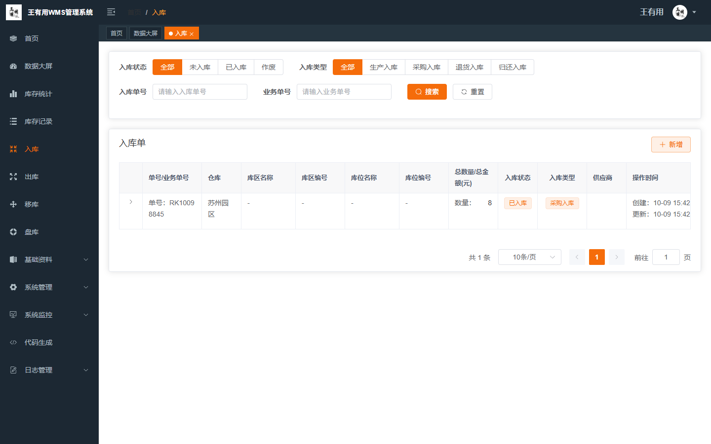
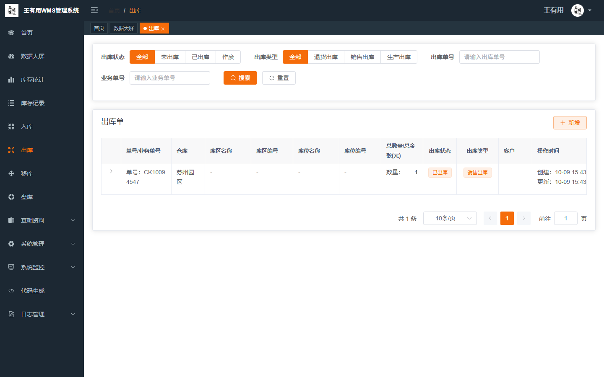
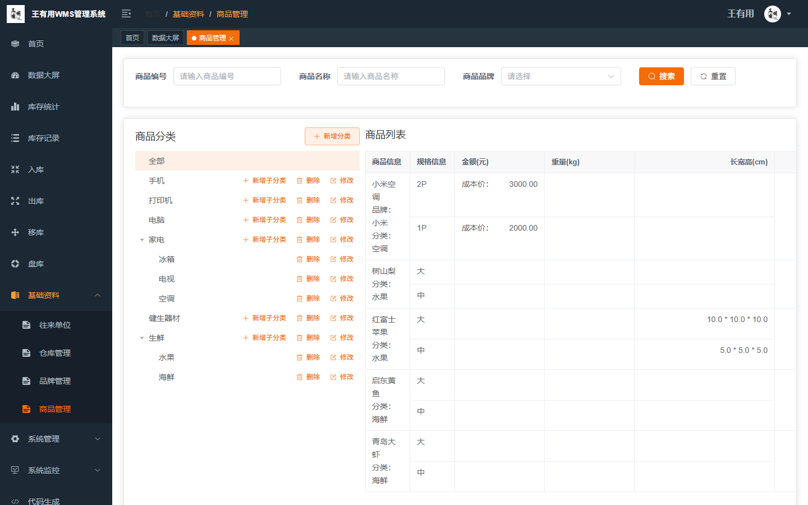
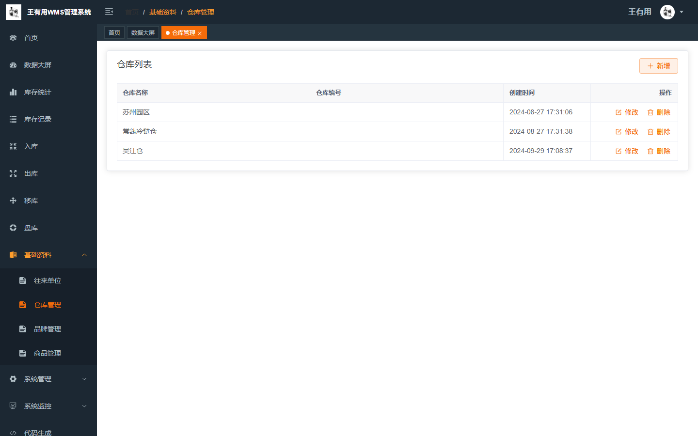
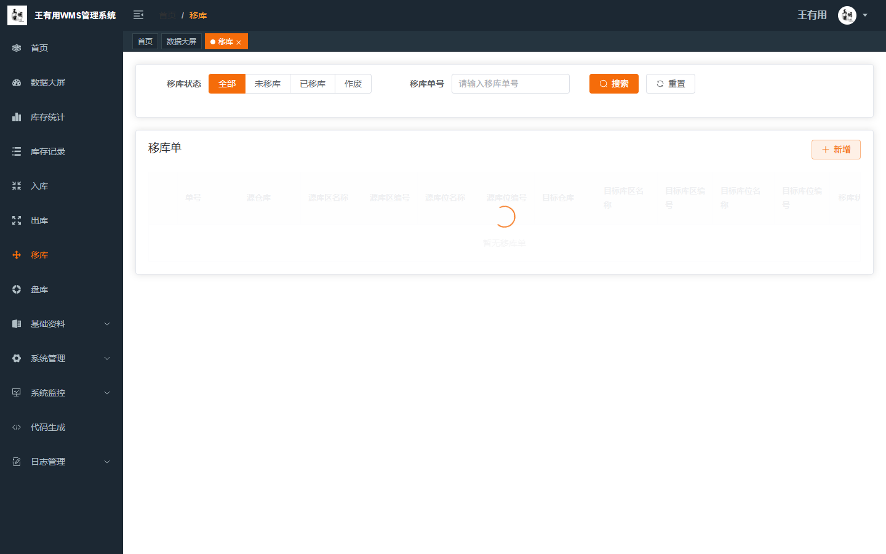
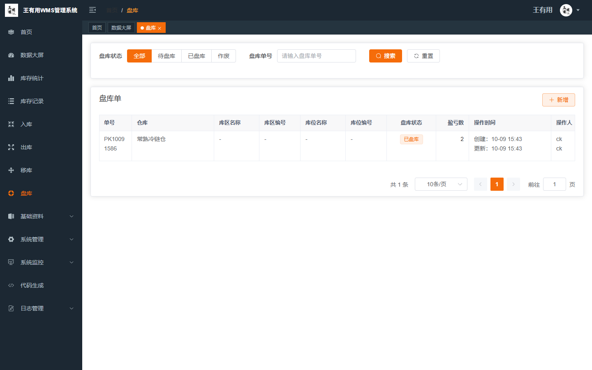
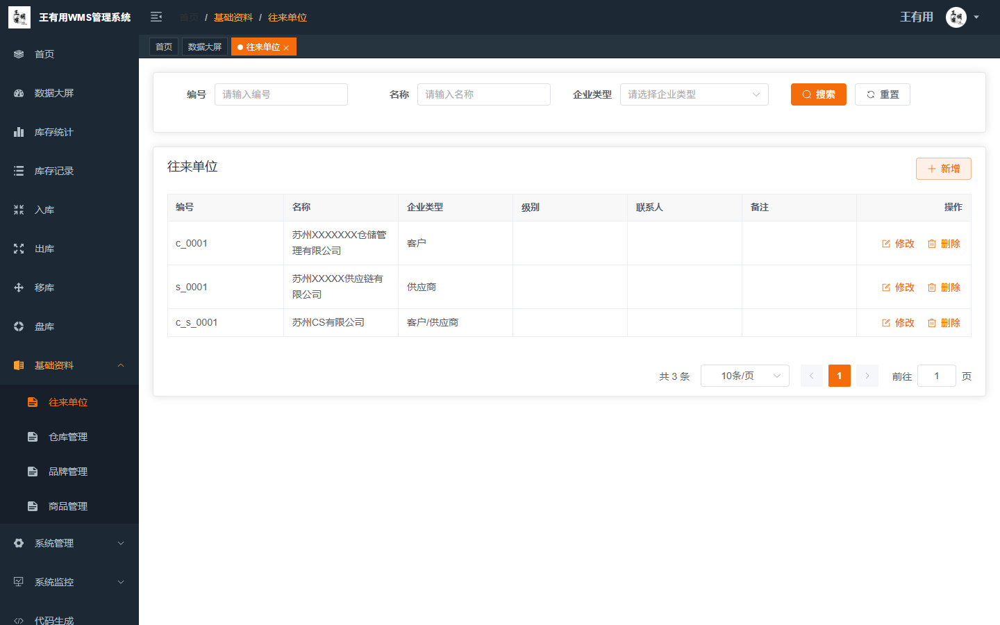
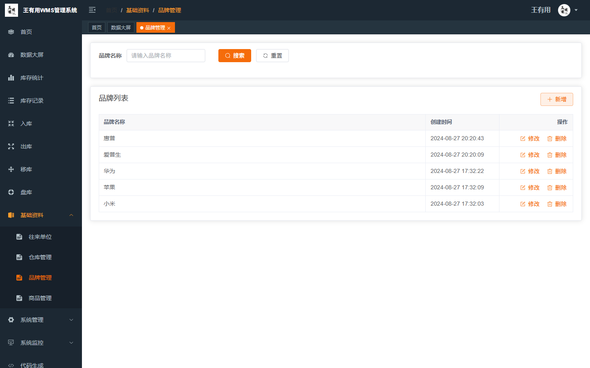

# 王有用 WMS 仓库管理系统

> 基于若依（RuoYi）框架二次开发的仓库管理系统（WMS），前端采用 Vue3 + Element Plus，后端采用 Spring Boot 3 + MyBatis Plus，支持多仓库、多库区、批次与序列号管理，覆盖仓储业务核心场景。

[](https://vuejs.org/)
[](https://element-plus.org/)
[](https://spring.io/projects/spring-boot)
[](https://adoptium.net/)
[](LICENSE)

---

## 项目简介

王有用 WMS 是一套面向中小型仓储场景的仓库管理系统，在若依快速开发框架之上，实现了完整的进销存业务闭环，并针对多仓库、多库区、批次、序列号等进阶场景进行了扩展。

- **前端**：Vue 3 + Element Plus + Vite + Pinia + ECharts
- **后端**：Spring Boot 3 + MyBatis Plus + Sa-Token + Redis + MySQL/MariaDB
- **权限认证**：JWT + Sa-Token，支持动态权限菜单、多终端认证
- **代码生成**：内置代码生成器，可一键生成前后端 CRUD 代码

## 功能特性

### 首页数据大屏
库存预警与到期提醒、基础数据报表、库存统计图表可视化展示。

### 库存管理
- **库存统计**：实时查看各仓库、库区、库位的库存数量
- **库存记录**：完整的库存变动流水，支持出入库、移库、盘点追溯

### 出入库作业
- **入库管理**：采购入库、退货入库，支持多明细、分批入库
- **出库管理**：销售出库、调拨出库，支持波次拣货
- **移库管理**：库区/库位间调拨
- **盘点管理**：库存盘点、盈亏调整

### 基础资料
- **往来单位**：客户 / 供应商统一管理
- **仓库管理**：多仓库、多库区、多库位三级管理
- **品牌管理**：商品品牌维护
- **商品管理**：商品分类（树形）、商品档案、多规格 SKU

### 进阶能力（已实现）
- 批次管理（生产日期 / 有效期 / 批次追溯）
- 序列号管理（一物一码）
- 波次拣货、发货计划、装车单管理
- 库存预警（超储 / 安全库存 / 呆滞）

## 技术栈

| 层级 | 技术 |
| ---- | ---- |
| 前端框架 | Vue 3.2、Vite 3 |
| UI 组件 | Element Plus 2.2 |
| 状态管理 | Pinia |
| 图表 | ECharts 5 |
| 后端框架 | Spring Boot 3.2.6 |
| ORM | MyBatis Plus + 动态数据源 |
| 权限认证 | Sa-Token + JWT |
| 缓存 | Redis + Redisson |
| 数据库 | MySQL / MariaDB |

## 项目结构

```
王有用WMS 管理系统
├── ruo-yi-wms-vue            # 前端项目（Vue3 + Vite）
│   ├── src/views/wms         # WMS 业务页面
│   ├── src/api               # 接口定义
│   └── vite.config.js        # 构建与代理配置
├── wms-ruoyi                 # 后端项目（Spring Boot 3）
│   ├── ruoyi-admin-wms       # 启动模块 + WMS 业务代码
│   ├── ruoyi-common          # 通用模块
│   ├── ruoyi-modules         # 系统模块（system / generator 等）
│   └── script/sql            # 数据库初始化脚本
└── docs/screenshots          # 项目截图
```

## 界面展示

### 登录页


### 首页数据大屏


### 库存统计


### 入库单


### 出库单


### 商品管理


### 仓库管理


### 库存记录


### 移库单


### 盘点单


### 往来单位


### 品牌管理


## 快速开始

### 环境要求

- JDK 17+
- Maven 3.6+
- Node.js 16+（推荐 18+）
- MySQL 5.7+ 或 MariaDB 10.x
- Redis 5+

### 后端启动

```bash
# 1. 初始化数据库
#    创建数据库 wms_ry（或自定义库名），导入脚本
#    wms-ruoyi/script/sql/wms.sql        —— 基础表 + 系统表 + 基础数据
#    wms-ruoyi/script/sql/wms-extra.sql  —— 库区/库位/批次/波次等进阶表

# 2. 修改数据库连接配置
#    wms-ruoyi/ruoyi-admin-wms/src/main/resources/application-dev.yml
#    将 url 中的数据库名、username、password 改为你的环境

# 3. 编译打包
cd wms-ruoyi
mvn clean package -DskipTests

# 4. 启动
java -jar ruoyi-admin-wms/target/ruoyi-admin-wms.jar --spring.profiles.active=dev
```

### 前端启动

```bash
cd ruo-yi-wms-vue

# 安装依赖
npm install --registry=https://registry.npmmirror.com

# 启动开发服务
npm run dev

# 构建生产环境
npm run build:prod
```

前端默认访问地址：`http://localhost:5173`（可通过 `vite.config.js` 的 `server.port` 调整）。

> **注意**：前端开发环境通过 `/dev-api` 前缀代理到后端，默认代理目标为 `http://localhost:8080`，请根据你的后端实际端口在 `vite.config.js` 中调整 `proxy` 配置。

### 默认账号

| 账号 | 密码 | 说明 |
| ---- | ---- | ---- |
| admin | admin123 | 管理员（王有用） |
| ck | —— | 仓库操作员 |

## 在线体验与参考

本项目基于优秀的开源项目 [ruo-yi-wms](https://gitee.com/zccbbg/wms-ruoyi)（作者 ZCC）二次开发，感谢原作者的无私开源。

- 后端参考：https://gitee.com/zccbbg/wms-ruoyi
- 前端参考：https://gitee.com/zccbbg/ruo-yi-wms-vue

## 许可证

本项目遵循 [MIT License](LICENSE)，开源免费可商用，使用时请保留开源协议文件。
